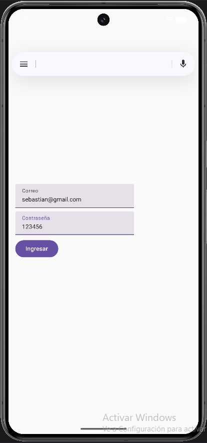
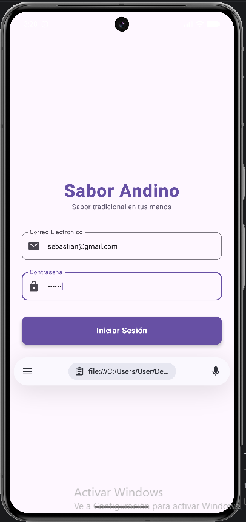
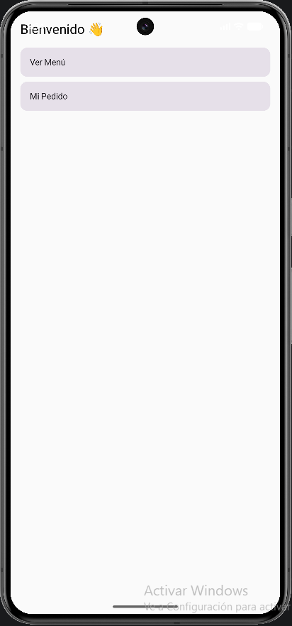
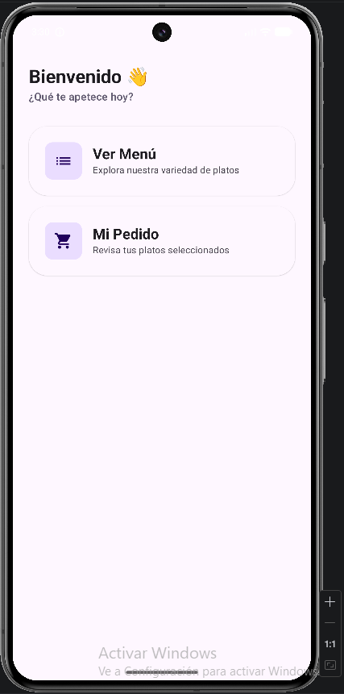
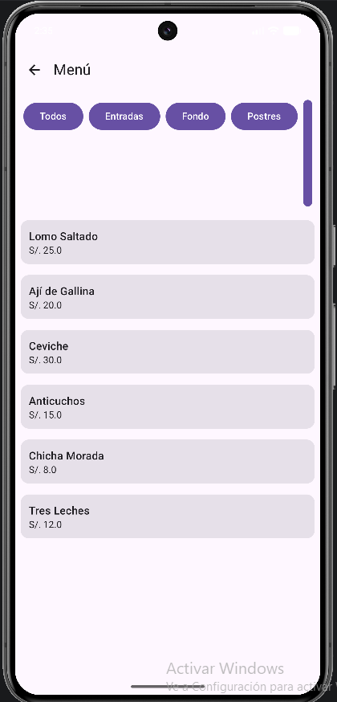
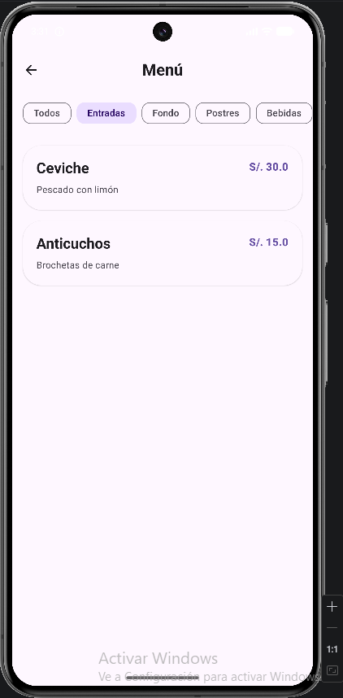
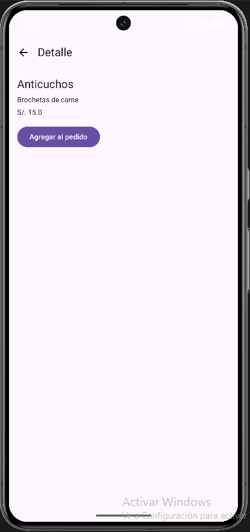
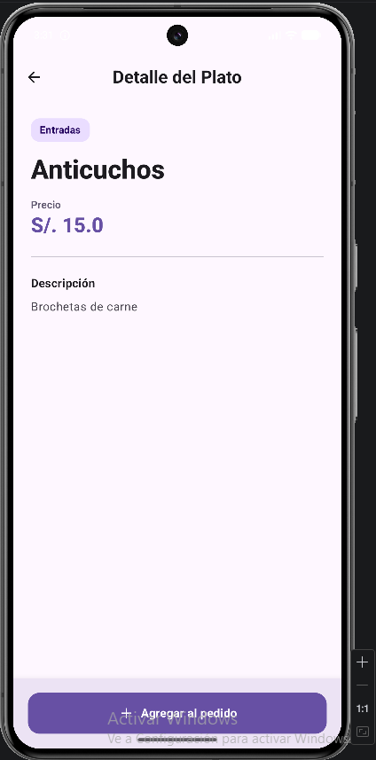
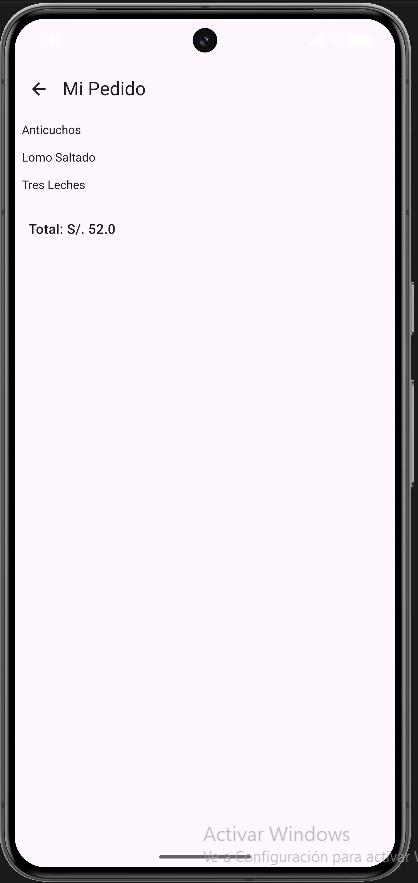
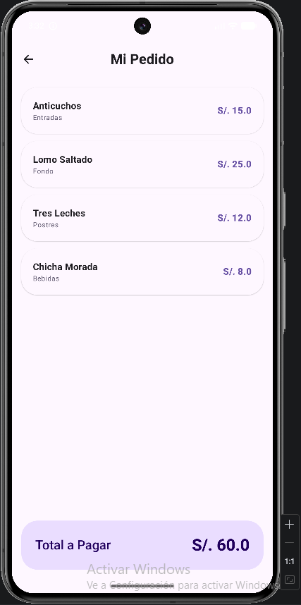

# SaborAndino — Mejoras con Gemini

Sabor Andino es una aplicación móvil nativa diseñada para modernizar la experiencia gastronómica de una reconocida cadena de cafeterías-restaurante especializada en comida fusión andina.  
El objetivo principal es conectar a los comensales con la riqueza culinaria tradicional mediante una plataforma intuitiva, ágil y visualmente atractiva que optimiza los procesos de atención y fidelización de clientes.

---

## 🤖 Auditoría de UI/UX con Gemini

Se utilizó Gemini en Android Studio como asesor de diseño para analizar las pantallas principales de la aplicación (Login, Home, Menu, Detail y Profile).  
El objetivo fue mejorar la apariencia visual sin modificar la lógica del proyecto.

---

## 📱 Comparación Antes vs Después

### 🔐 Pantalla de Inicio de Sesión

**Antes (Original):**  

**Después (Mejorado con IA):**  

---

### 🏠 Pantalla Principal

**Antes (Original):**  

**Después (Mejorado con IA):**  

---

### 🍽️ Menú de Platos

**Antes (Original):**  

**Después (Mejorado con IA):**  

---

### 📄 Detalle del Plato

**Antes (Original):**  

**Después (Mejorado con IA):**  

---

### 👤 Mi Pedido

**Antes (Original):**  

**Después (Mejorado con IA):**  

---

## 💬 Prompt utilizado en Gemini
Actúa como un experto diseñador UI de Android usando Jetpack Compose, necesito que rediseñes visualmente todas las pantallas de la aplicación (Detail, Profile, Home, Login, Menu, etc) porque actualmente tienen un diseño básico, esto está dirigido a una app real (SaborAndino) con la lógica ya implementada, quiero que respondas devolviendo únicamente el código modificado sin explicaciones, ten en cuenta estas condiciones: no modificar la lógica del negocio, no cambiar navegación ni rutas, no renombrar variables, funciones o archivos, no agregar nuevas funcionalidades, no eliminar funcionalidad existente, solo mejorar el diseño visual de forma notoria aplicando mejores prácticas de Material 3, manteniendo compatibilidad con Material Icons y respetando la estructura actual del código y manejo de estado, mejora componentes como botones (chips o tabs), cards con elevación y bordes redondeados, spacing consistente, tipografía con mejor jerarquía (nombre vs precio), uso de MaterialTheme.colorScheme y una apariencia moderna tipo app profesional de Play Store, evitando dejar componentes con estilo por defecto.

---

## ✨ Mejoras implementadas

Gracias a las sugerencias de Gemini, se realizaron las siguientes mejoras:

- Mejora de la jerarquía visual (tipografía y tamaños)
- Uso más adecuado de Material 3 (Cards, colores, elevación)
- Espaciado consistente entre componentes
- Rediseño de botones y elementos interactivos
- Interfaz más moderna y profesional

---

## 🧠 Reflexión

La IA ayudó a optimizar rápidamente el diseño visual de las interfaces, obteniendo una estética más contemporánea sin alterar la lógica del proyecto. No obstante, en ciertos casos fue imprescindible modificar manualmente algunos aspectos para asegurar la coherencia y prevenir alteraciones indeseadas. En términos generales, contribuyó a acelerar el proceso de optimización de la interfaz de usuario.